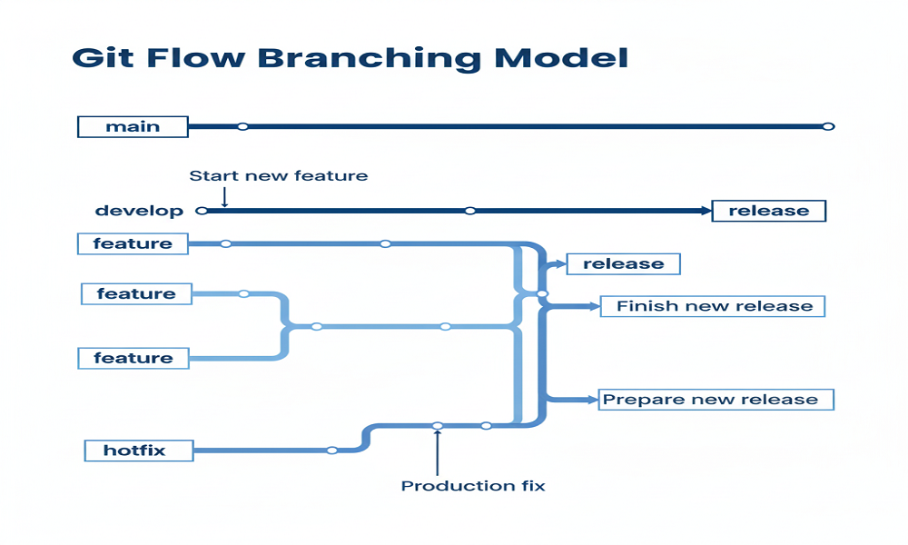

# 🔗 Dynamics 365 (D365) Inventory Synchronization Service

## Project Purpose

This project is a C# portfolio piece demonstrating key skills required for a Dynamics 365 / Power Platform development: **secure data integration, separation of concerns, and robust business logic implementation.**

It models a common enterprise scenario where an external system (e.g., a Warehouse Management System or E-commerce platform) holds product inventory data that must be regularly synchronized with a D365 environment (Dataverse).

The application is built as a **Clean Architecture** ASP.NET Core Web API, acting as a middleware layer to isolate the two systems and manage the complex synchronization rules.

## Visual Overview

### High-Level Architecture

This diagram illustrates the Clean/Onion Architecture structure, ensuring the Core business logic is isolated from external systems.

The solution is divided into three distinct layers, ensuring that the core business logic has no direct dependency on external infrastructure or the API layer:

1.  **`SyncService.Core` (Domain/Business Logic):** Contains all domain models, interfaces, and the core synchronization logic. **This layer knows nothing about D365 or HTTP.**
2.  **`SyncService.Infrastructure` (Data Access/External):** Implements the interfaces defined in `Core`. This is where the mocked D365 SDK and the external API calls would live.
3.  **`SyncService.Api` (Presentation):** The ASP.NET Core Web API project. It exposes the single endpoint used to trigger the synchronization process.

## Git Workflow

The project follows the Git Flow branching strategy to ensure a professional and organized development process.

## Technical Stack & Skills Demonstrated

| **Technology**                | **D365 Relevance**                                                                                                   |
| ----------------------------- | -------------------------------------------------------------------------------------------------------------------- |
| **C# 13 & .NET 9**            | Core language for writing D365 Plugins, Custom Workflow Activities, and Azure Functions.                             |
| **ASP.NET Core Web API**      | Building secure, scalable external endpoints for D365 integrations (e.g., WebHooks).                                 |
| **Clean Architecture**        | Structuring complex business applications to ensure maintainability, testability, and adherence to SOLID principles. |
| **Dependency Injection (DI)** | Managing the lifecycle of services, especially those connecting to external systems.                                 |
| **Unit Testing (xUnit/Moq)**  | Writing tests for isolated business logic (crucial for reliable D365 plugins).                                       |
| **API Consumption & Mocking** | Handling external communication, timeouts, and error scenarios.                                                      |

## Simulated Scenario: Product Inventory Sync

The goal is to synchronize product stock levels:

1.  An API client (simulating an Azure Function or Power Automate Flow) calls the `SyncService.Api` endpoint.
2.  The Core Synchronization Service asks the **External Inventory System (Mock)** for the current stock list.
3.  The Core Synchronization Service compares the list and calls the **D365 Dataverse Connector (Mock)** to update or create `ProductInventory` records.
4.  Any critical error is logged and returned in the API response.
