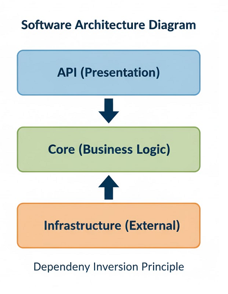
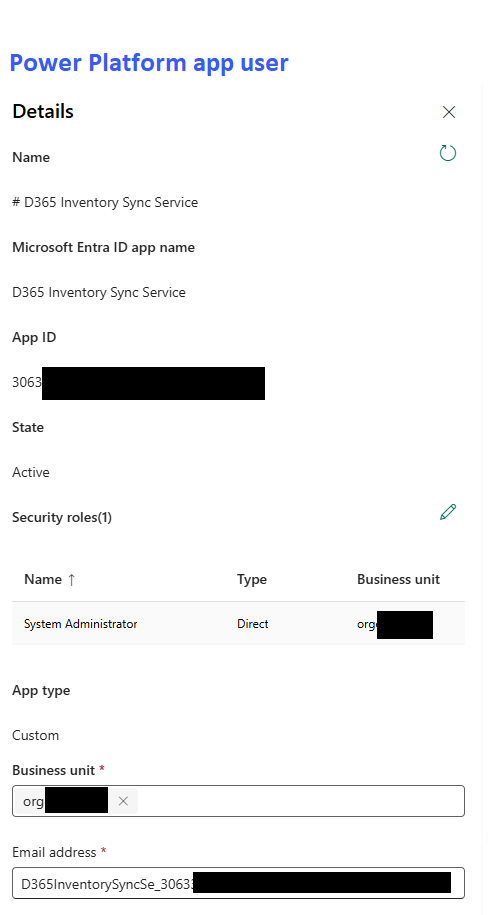

# 🔗 Dynamics 365 (D365) Inventory Synchronization Service

## Project Purpose

This project is a C# portfolio piece demonstrating key skills required for a Dynamics 365 / Power Platform development: **secure data integration, separation of concerns, and robust business logic implementation.**

It models a common enterprise scenario where an external system (e.g., a Warehouse Management System or E-commerce platform) holds product inventory data that must be regularly synchronized with a D365 environment (Dataverse).

The application is built as a **Clean Architecture** ASP.NET Core Web API, acting as a middleware layer to isolate the two systems and manage the complex synchronization rules.

## Visual Overview

### High-Level Architecture

This diagram illustrates the Clean/Onion Architecture structure, ensuring the Core business logic is isolated from external systems.

The solution is divided into three distinct layers, ensuring that the core business logic has no direct dependency on external infrastructure or the API layer:

1.  **`SyncService.Core` (Domain/Business Logic):** Contains all domain models, interfaces, and the core synchronization logic. **This layer knows nothing about D365 or HTTP.**
2.  **`SyncService.Infrastructure` (Data Access/External):** Implements the interfaces defined in `Core`. This is where the mocked D365 SDK and the external API calls would live.
3.  **`SyncService.Api` (Presentation):** The ASP.NET Core Web API project. It exposes the single endpoint used to trigger the synchronization process.

## Git Workflow

The project follows the Git Flow branching strategy to ensure a professional and organized development process.

The project follows the Git Flow branching strategy to ensure a professional and organized development process.

## Prerequisites for D365 Integration

To run the application against a live Dynamics 365 environment (as implemented in Day 5), the following external components must be set up:

1.  **Power Apps Developer Environment:** A D365/Dataverse instance is required. A free Power Apps Developer Plan environment can be used.

2.  **Azure AD App Registration:** An application must be registered in Microsoft Entra ID (Azure AD) to provide authentication credentials (Client ID, Tenant ID, Client Secret).

3.  **Power Platform Application User:** The Azure AD App Registration must be linked to an Application User within the target Power Platform Environment, and granted appropriate permissions (e.g., System Administrator for development).

## Technical Stack & Skills Demonstrated

| **Technology**                | **D365 Relevance**                                                                                                   |
| ----------------------------- | -------------------------------------------------------------------------------------------------------------------- |
| **C# 13 & .NET 9**            | Core language for writing D365 Plugins, Custom Workflow Activities, and Azure Functions.                             |
| **ASP.NET Core Web API**      | Building secure, scalable external endpoints for D365 integrations (e.g., WebHooks).                                 |
| **Clean Architecture**        | Structuring complex business applications to ensure maintainability, testability, and adherence to SOLID principles. |
| **Dependency Injection (DI)** | Managing the lifecycle of services, especially those connecting to external systems.                                 |
| **Unit Testing (xUnit/Moq)**  | Writing tests for isolated business logic (crucial for reliable D365 plugins).                                       |
| **API Consumption & Mocking** | Handling external communication, timeouts, and error scenarios.                                                      |

## Simulated Scenario: Product Inventory Sync

The goal is to synchronize product stock levels:

1.  An API client (simulating an Azure Function or Power Automate Flow) calls the `SyncService.Api` endpoint.
2.  The Core Synchronization Service asks the **External Inventory System (Mock)** for the current stock list.
3.  The Core Synchronization Service compares the list and calls the **D365 Dataverse Connector (Mock)** to update or create `ProductInventory` records.
4.  Any critical error is logged and returned in the API response.

## 🚀 Demonstration (Pics & GIFs)

### Unit Test Execution

This GIF shows the dotnet test command running and verifying the core business logic in isolation.

### API Functionality

The following GIF shows the API being executed via Swagger, calling the mock services, and returning a successful result.

### End-to-End Synchronization with D365

This GIF demonstrates the complete workflow: the D365 environment before the sync, executing the API call via Swagger, and the product records appearing/updating in D365 afterward.

### Error Handling Test

This GIF demonstrates the API returning a 500 Internal Server Error when provided with invalid credentials, showing basic error handling.

